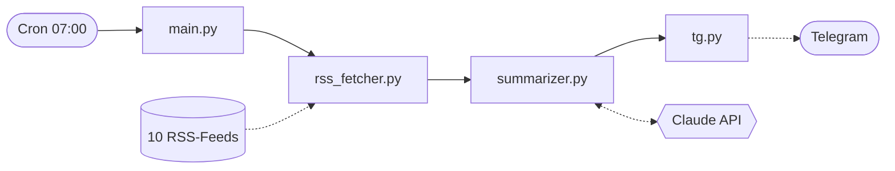

# 📰 News Agent

Ein kleines Python-Programm, das jeden Morgen um 07:00 Wirtschaftsnachrichten aus
10 RSS-Feeds einsammelt, sie von **Claude** zu einem Briefing zusammenfassen lässt
und es per **Telegram** verschickt.

Statt zehn News-Apps durchzuscrollen: eine Nachricht, 60 Sekunden Lesezeit, mit
Links zu den Originalartikeln. Persönliches Projekt, seither täglich im Einsatz.

## Architektur



Vier Schritte nacheinander – kein Server, keine Datenbank, kein dauerhaft laufendes
Programm. Cron startet das Skript, nach dem Versand beendet es sich wieder.

→ **[Details zur Architektur](docs/architecture.md)**

## Beispiel

```
☀️ Guten Morgen!

Die Märkte sind wach, der Kaffee ist heiss – legen wir los.

🇨🇭 SCHWEIZ
• Die SNB belässt den Leitzins bei 0.25%. — NZZ

🌍 MAKRO
• Die EZB signalisiert eine längere Zinspause. — Handelsblatt

📈 MÄRKTE
• Der SMI schliesst 0.8% höher. — Bloomberg

💡 Daily Fun Fact
• Honig verdirbt nie – in ägyptischen Gräbern gefundene Töpfe
  waren nach 3000 Jahren noch geniessbar.
```

*(Beispiel mit erfundenen Zahlen.)*

## Module

| Datei | Aufgabe |
|---|---|
| `main.py` | Ruft die drei Schritte nacheinander auf |
| `rss_fetcher.py` | Feeds laden und filtern (letzte 20 h, max. 5 pro Feed) |
| `summarizer.py` | Prompt bauen und Claude API aufrufen |
| `tg.py` | Versand via Telegram |

## Setup

```bash
git clone https://github.com/claudiokoller/news-agent.git
cd news-agent

python -m venv .venv && source .venv/bin/activate   # Windows: .venv\Scripts\activate
pip install -r requirements.txt

cp .env.example .env    # API-Key und Telegram-Daten eintragen
python main.py
```

Die drei Zugangsdaten stehen in der `.env` – wo man sie herbekommt, erklärt
[`.env.example`](.env.example). Die Datei selbst ist nie Teil des Repos.

Für den täglichen Betrieb genügt ein Crontab-Eintrag:

```cron
0 7 * * * /usr/bin/python3 /pfad/zu/news-agent/main.py >> /var/log/news-agent.log 2>&1
```

## Tests

```bash
pip install pytest && pytest
```

Getestet sind die Funktionen, die ohne Netzwerk und ohne API-Key laufen.

## Lizenz

[MIT](LICENSE)
