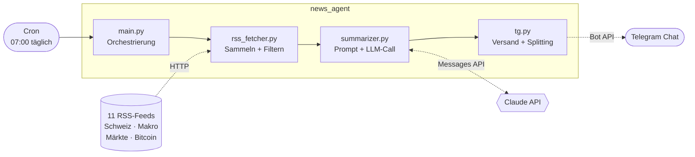

# Architektur

Der News Agent ist eine lineare Pipeline, die einmal täglich durchläuft und danach
wieder beendet wird. Es gibt keinen laufenden Prozess, keine Datenbank und keinen
Server – das Scheduling übernimmt Cron.

## Überblick

## Ablauf im Detail

| # | Schritt | Modul | Was passiert |
|---|---------|-------|--------------|
| 1 | **Fetch** | `rss_fetcher.py` | Alle Feeds werden nacheinander geparst. Ein Feed, der nicht erreichbar ist, wird geloggt und übersprungen – die Pipeline läuft weiter. |
| 2 | **Filter** | `rss_fetcher.py` | Nur Artikel der letzten 20 Stunden, max. 5 pro Feed. HTML wird aus dem Teaser entfernt und auf 500 Zeichen gekürzt. |
| 3 | **Normalisieren** | `rss_fetcher.py` | Jeder Artikel wird zu einem `Article`-Dataclass (Titel, Quelle, Kategorie, Teaser, URL, Uhrzeit). |
| 4 | **Prompting** | `summarizer.py` | Artikel werden nach Kategorie gruppiert als kompakter Text aufbereitet und mit einem System-Prompt an Claude geschickt. |
| 5 | **Generierung** | `summarizer.py` | Claude erzeugt das fertige Briefing in Telegram-HTML, inkl. Inline-Quellenlinks. |
| 6 | **Versand** | `tg.py` | Nachricht wird bei Bedarf an Zeilenumbrüchen gesplittet und via Bot API zugestellt. |

## Designentscheidungen

**Warum Filtern *vor* dem LLM-Call?**
Ohne Begrenzung landen schnell 100+ Artikel im Prompt. Das Zeitfenster (20 h) und das
Limit pro Feed (5) halten die Kosten pro Lauf klein und verhindern, dass eine
schreibfreudige Quelle das Briefing dominiert.

**Warum bestimmt der Prompt das Ausgabeformat?**
Das Briefing ist reiner Text für einen Chat. Ein Zwischenschritt über strukturiertes
JSON mit anschliessendem Renderer wäre mehr Code für dasselbe Resultat. Die Regeln
(Zeichenlimit, Schweizer Rechtschreibung, erlaubte HTML-Tags, max. Bulletpoints pro
Quelle) stehen deshalb direkt im System-Prompt.

**Fehlertoleranz statt Perfektion.**
Jede Stufe hat einen definierten Ausfallmodus: Feed down → überspringen. Keine
Artikel → Lauf sauber beenden. API-Fehler → loggen, nichts senden. Telegram lehnt
das HTML ab → Fallback auf Plain Text. Ein einzelner Fehler kostet nie das ganze
Briefing.

**Zustandslos.**
Jeder Lauf ist unabhängig. Das Zeitfenster ersetzt eine "schon gesehen"-Datenbank –
gut genug für einen täglichen Rhythmus und spart die gesamte Persistenzschicht.

## Erweiterungspunkte

- **Neue Quelle:** einen Eintrag in `FEEDS` (`rss_fetcher.py`) ergänzen.
- **Neue Kategorie:** Kategorie am Feed setzen und die Sektion im System-Prompt ergänzen.
- **Anderer Kanal:** `tg.py` durch ein Modul mit `send_briefing(text)` ersetzen – der
  Rest der Pipeline bleibt unverändert.
