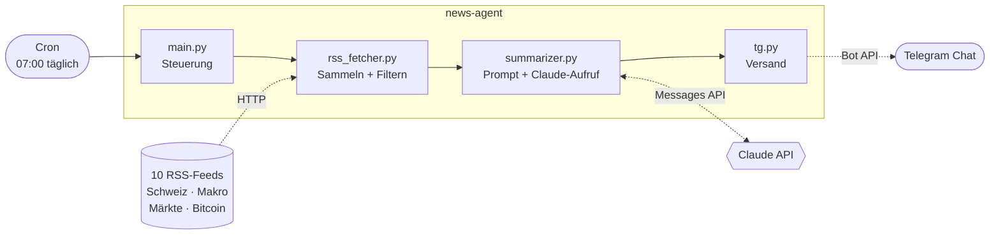

# Architektur

Das Programm läuft einmal täglich von oben nach unten durch und beendet sich
danach wieder. Kein Server, keine Datenbank, kein dauerhaft laufendes Programm –
den Start übernimmt Cron.

## Ablauf

1. **Sammeln** – alle Feeds werden geparst, mit Timeout und Browser-User-Agent.
   Ein Feed, der nicht antwortet oder nichts liefert, wird geloggt und übersprungen.
2. **Filtern** – nur Artikel der letzten 20 Stunden, max. 5 pro Feed. HTML raus,
   auf 500 Zeichen gekürzt und in eine einheitliche Form gebracht.
3. **Zusammenfassen** – die Artikel gehen nach Kategorie gruppiert in einen
   einzigen Claude-Aufruf, der das fertige Briefing in Telegram-HTML zurückgibt.
4. **Senden** – lange Nachrichten werden an Zeilenumbrüchen gesplittet.

## Warum es so gebaut ist

**Erst filtern, dann fragen.** Ohne Begrenzung landen schnell 100+ Artikel im
Prompt. Zeitfenster und Limit pro Feed halten die Kosten klein und verhindern,
dass eine schreibfreudige Quelle das Briefing dominiert.

**Claude liefert das fertige Format.** Das Briefing ist am Ende einfach Text für
einen Chat. Deshalb steht alles, was die Form betrifft – Länge, Schweizer
Rechtschreibung, erlaubte HTML-Tags – direkt im Prompt, statt in zusätzlichem Code.

**Jede Stufe darf ausfallen.** Feed down → überspringen. Keine Artikel → sauber
beenden. API-Fehler → loggen, nichts senden. Telegram lehnt die
Formatierung ab → nochmal als einfacher Text senden. Ein einzelner Fehler kostet nie das ganze Briefing.

**Kein Gedächtnis nötig.** Jeder Lauf ist unabhängig vom vorherigen. Statt zu
speichern, welche Artikel schon im Briefing waren, schaut das Programm einfach
nur 20 Stunden zurück – bei einem täglichen Lauf reicht das.

## Erweitern

- **Neue Quelle:** Eintrag in `FEEDS` (`rss_fetcher.py`) ergänzen.
- **Anderer Kanal:** `tg.py` durch ein Modul mit `send_briefing(text)` ersetzen –
  der Rest des Ablaufs bleibt unverändert.
