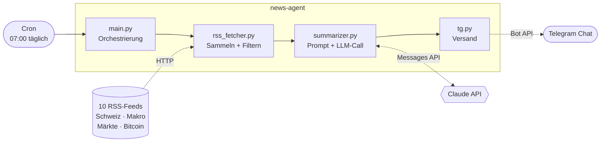

# Architektur

Der News Agent ist eine lineare Pipeline, die einmal täglich durchläuft und sich
danach beendet. Kein Server, keine Datenbank, kein laufender Prozess – das
Scheduling übernimmt Cron.

## Ablauf

1. **Sammeln** – alle Feeds werden geparst, mit Timeout und Browser-User-Agent.
   Ein Feed, der nicht antwortet oder nichts liefert, wird geloggt und übersprungen.
2. **Filtern** – nur Artikel der letzten 20 Stunden, max. 5 pro Feed. HTML raus,
   auf 500 Zeichen gekürzt, als `Article`-Dataclass normalisiert.
3. **Zusammenfassen** – die Artikel gehen nach Kategorie gruppiert in einen
   einzigen Claude-Aufruf, der das fertige Briefing in Telegram-HTML zurückgibt.
4. **Senden** – lange Nachrichten werden an Zeilenumbrüchen gesplittet.

## Designentscheidungen

**Filtern vor dem LLM-Call.** Ohne Begrenzung landen schnell 100+ Artikel im
Prompt. Zeitfenster und Limit pro Feed halten die Kosten klein und verhindern,
dass eine schreibfreudige Quelle das Briefing dominiert.

**Das Format steckt im Prompt.** Das Briefing ist Text für einen Chat. Ein Umweg
über strukturiertes JSON und einen Renderer wäre mehr Code für dasselbe Resultat.
Zeichenlimit, Schweizer Rechtschreibung und erlaubte HTML-Tags stehen deshalb
direkt im System-Prompt.

**Jede Stufe darf ausfallen.** Feed down → überspringen. Keine Artikel → sauber
beenden. API-Fehler → loggen, nichts senden. Telegram lehnt das HTML ab →
Plain-Text-Fallback. Ein einzelner Fehler kostet nie das ganze Briefing.

**Zustandslos.** Jeder Lauf ist unabhängig. Das Zeitfenster ersetzt eine
„schon gesehen"-Datenbank – gut genug für einen täglichen Rhythmus.

## Erweitern

- **Neue Quelle:** Eintrag in `FEEDS` (`rss_fetcher.py`) ergänzen.
- **Anderer Kanal:** `tg.py` durch ein Modul mit `send_briefing(text)` ersetzen –
  der Rest der Pipeline bleibt unverändert.
